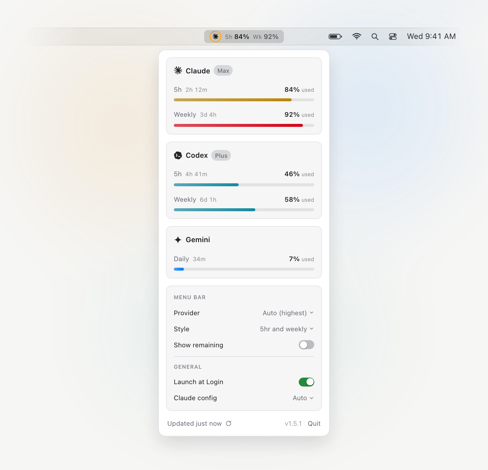

# Usage Meter

[](https://github.com/ehermanson/usage-meter/actions/workflows/ci.yml)
[](https://github.com/ehermanson/usage-meter/actions/workflows/release.yml)
[](https://github.com/ehermanson/usage-meter/releases/latest)

[](LICENSE)

A tiny macOS menu-bar app showing how much of your **Claude**, **Codex**, and
**Gemini** usage you've burned, at a glance.

**[usage-meter.eric-r-hermanson.workers.dev](https://usage-meter.eric-r-hermanson.workers.dev/)** ·
[**Download**](https://github.com/ehermanson/usage-meter/releases/latest)

<p align="center">
  <picture>
    <source media="(prefers-color-scheme: dark)" srcset="docs/demo-dark.png">
    <source media="(prefers-color-scheme: light)" srcset="docs/demo-light.png">
    
  </picture>
</p>

The menu-bar title tracks one provider's 5-hour and weekly usage: by default
whichever is closest to its limit, or pin a specific one. Bars turn **yellow at
75%** and **red at 90%**. Dropdown options include **Compact** (title shows the
5-hour window only), **Show % remaining**, and **Launch at Login**.

## Install

1. Download **`UsageMeter.dmg`** from the [latest release](https://github.com/ehermanson/usage-meter/releases/latest).
2. Open it, drag **Usage Meter** into **Applications**, and launch it from there.

That's the last time you'll touch a DMG: when a new release ships, the dropdown
shows an **Update to vX** button that downloads, verifies, installs, and
relaunches in place with one click.

It reads usage from tools you already have: [Node.js](https://nodejs.org) and
[Claude Code](https://docs.claude.com/en/docs/claude-code/setup) (Claude), the
[Codex CLI](https://github.com/openai/codex), and a Gemini sign-in (Antigravity
or the Gemini CLI). Any provider that isn't set up shows a **Set up ↗** hint
until you install or sign in.

## Develop

```sh
swift test                 # run the unit tests
./build.sh                 # build build/UsageMeter.app (self-contained)
open build/UsageMeter.app
```

Swift sources are formatted with `swift format` (config in
[`.swift-format`](.swift-format)). `.build/release/UsageMeter --selftest` prints
each provider's windows without the UI.

## Release

Push a tag and [the release workflow](.github/workflows/release.yml) builds, signs,
notarizes, staples, and publishes the `.dmg` and `.zip`:

```sh
git tag v1.2.0 && git push origin v1.2.0
```

The one-time signing secrets are documented at the top of that workflow file.

The `.zip` also feeds the in-app updater, which matches the asset by its exact
name (`UsageMeter.zip`) and verifies the download's code signature against the
app's Developer ID team before installing. Renaming that asset or changing the
signing identity won't break anything visibly — updates just silently fall back
to the browser download.

## License

[MIT](LICENSE) © Eric Hermanson
